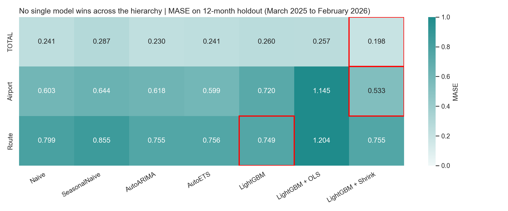
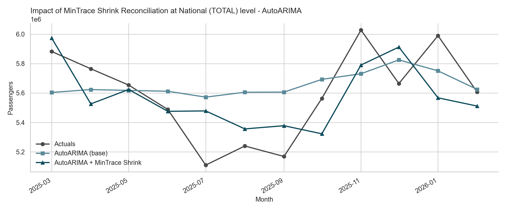
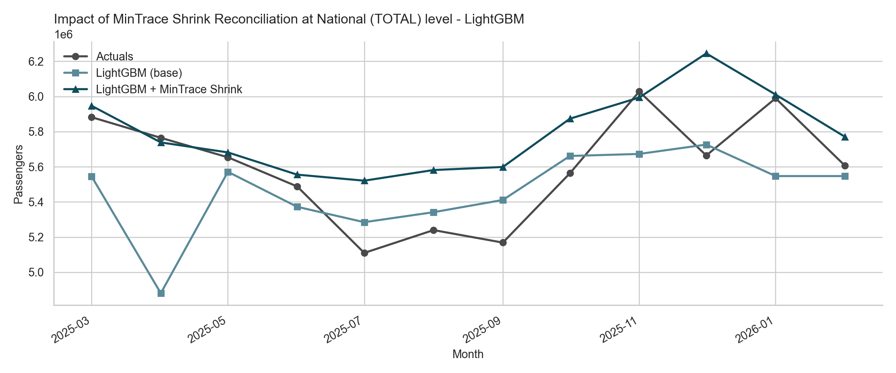

# Hierarchical Forecasting of Indian Air Traffic
Forecasting India's air traffic volume with reconciliation across the national, airport and route hierarchy using the Minimum Trace (MinTrace) method. No single model wins across hierarchy. LightGBM with MinTrace Shrink reconciliation achieves the best aggregate accuracy at national and airport levels.

## Motivation
Air traffic volume forecasts are required at varying degree of granularity. At the national level, the total volume is required for macro planning. At the airport level, these forecasts are used for capacity planning. At the route level, the forecasts are used for scheduling airlines. Independent forecasts at each level are prone to inconsistency. Airport forecasts won't add up to the national forecast. This project aims to solve this problem by applying hierarchical reconciliation to the forecasts, ensuring they are coherent at all levels.

## Data
The monthly domestic city-pair passenger traffic data is sourced from Directorate General of Civil Aviation (DGCA), India via the [Vonter/india-aviation-traffic](https://github.com/Vonter/india-aviation-traffic) dataset (ODbL - 1.0)

- **Coverage:** April 2015 to February 2026
- **Granularity:** Monthly, directional (City 1 -> City 2)
- **Cities:** Approx. 134 airports
- **Routes:** Approx. 1855 unique city pairs
- **Routes Analyzed:** Top 200 by total passenger volume, covering 78.9% of total traffic
- **Train Window:** April 2015 to February 2025
- **Holdout Window:** March 2025 to February 2026 (12 months)

## Hierarchy
The hierarchy was designed with three levels: TOTAL, Airport, and Route. TOTAL represents national air traffic as a single series. Of the top 200 routes by passenger volume, 3 were removed at the EDA stage due to insufficient data points, leaving 197 routes across 30 origin airports. Routes form the base level and roll up to their origin airports; all 30 airports roll up to TOTAL. The hierarchy spans 228 series in total (1 + 30 + 197).

## Methodology
Once the hierarchy was designed and data prepared, I proceeded with the base forecasting with four different models - Naive, SeasonalNaive, AutoARIMA and AutoETS, all supported by the StatsForecast library. StatsForecast fits these models in parallel across all the 228 series with a consistent API.  Naive and SeasonalNaive were treated as benchmarks for all other models. AutoARIMA and AutoETS were picked to handle the trend and seasonality of data without any manual intervention. All these four models were expected to produce incoherent forecasts, which were reconciled at the later stage.

I also used LightGBM as a global model (one model on all 228 series) instead of per series. The logic behind this was two-fold. One, almost all these series share similar characteristics (trend, shock and seasonality patterns). Pooling helps in such a situation as the model can learn from the shared structure of the data series. Two, per-series model will have only 130 data points to learn from, risking overfitting. LightGBM was chosen for its native categorical feature handling and fast training capabilities. Feature engineering for training this LightGBM model included lags, rolling means, calendar features and categorical features for hierarchy levels. The train-test split was retained as the same that used for base forecasting models. 

Both the base models and global model generated forecasts that were incoherent across the hierarchy - the forecasts at the child level do not add up to the parent level. In order to make the forecasts coherent, I chose MinTrace (Wickramasuriya, Athanasopoulos, Hyndman 2019) reconciliation method from the HierarchicalForecast library. The reconciliation was tested on two covariance estimators - OLS (the simplest of all) and Shrink. Shrink estimator was expected to be more robust considering the fact that the series count differed across levels. Comparing the two, I wanted to explore if the additional complexity of Shrink was worth it in practice.

## Results
1. No single model wins across the hierarchy levels

As evident above, no single model wins across the hierarchy. LightGBM + Shrink wins at TOTAL and Airport levels whereas LightGBM base model without any reconciliation wins at Route level. Notably, LightGBM + OLS breaks at lower levels of the hierarchy with a MASE value > 1.

2. Reconciliation improves MASE by 14% at National (TOTAL) level for AutoARIMA


While base AutoARIMA forecast is flat near 5.6M, MinTrace Shrink reconciliation improves the forecast by capturing the mid-season dip and late-year surge. MASE improves from 0.230 to 0.198 (14% improvement).

3. Reconciliation fixes outliers and improves MASE by 24% at National (TOTAL) level for LightGBM


Base LightGBM is more responsive compared to AutoARIMA but has an outlier in April 2025. This is corrected by MinTrace Shrink reconciliation and forecast closely follows actuals till October. During the end-of-year peak season, the reconciled forecast overshoots the actuals. The improvement in MASE is significant (24%) from 0.260 to 0.198. 


## Findings and Limitations
**Findings**
- No single model dominates across the hierarchy. The best-performing model varies with the level of aggregation.
- MinTrace Shrink reconciliation consistently improves the forecast accuracy at both National (TOTAL) and Airport levels. The LightGBM + MinTrace Shrink Reconciliation wins at both levels.
- Shrink method of reconciliation is robust and outperforms the OLS method which breaks at lower levels of the hierarchy with a MASE > 1.

**Limitations**
- The holdout window was a single 12-month period. There is a possibility of the results being window-specific.
- The selection of top 200 routes by volume left behind the tail routes (21.1% by volume).
- Feature engineering was limited to the basics - lag and calendar features alone. Holidays, fuel prices, capacity additions, COVID indicators are not modelled. 

## How to Run
1. **Clone the repo:**
```
git clone <repo-url>
cd india-air-traffic-forecast
```
2. **Install dependencies**
```
pip install -r requirements.txt
```

3. **Get the raw data:**
Download `city_domestic.csv` from [Vonter/india-aviation-traffic](https://github.com/Vonter/india-aviation-traffic) and place it in `data/raw/`.

4. **Run notebooks in order:**
    - `01_eda.ipynb` — exploratory data analysis
    - `02_data_prep.ipynb` — cleaning, hierarchy construction
    - `03_base_forecasting.ipynb` — Naive, SeasonalNaive, AutoARIMA, AutoETS
    - `04_reconciliation.ipynb` — MinTrace OLS and Shrink
    - `05_lightgbm.ipynb` — global LightGBM model + reconciliation
    - `06_visualizations.ipynb` — heatmap and reconciliation impact charts 

##  Repo Structure
```
data/
    raw/ # source CSV from DGCA via Vonter dataset (gitignored)
    processed/ # cleaned, hierarchy-ready data
notebooks/ # EDA and modelling experiments
src/ # reusable modules: data preparation, forecasting and reconciliation
outputs/ # charts, tables, results (gitignored)
```
## Status
Active build - sprint April 2026

## Author
Rahul Mohan - Senior Consultant, EY-Parthenon | PG Diploma in Advanced Business Analytics, IIM Ahmedabad

## Attribution
Data: DGCA (https://www.dgca.gov.in/) via [Vonter/india-aviation-traffic](https://github.com/Vonter/india-aviation-traffic), ODbL-1.0.